# 🧪 Exercise #1: RFQx – AI-Powered RFQ Document Analysis (SAP AI Core + Cloud Foundry)

> **Original project:** This exercise is based on the [RFQx Document Analysis Application](https://ai4u-website.cfapps.eu10-004.hana.ondemand.com/project/sap-rfqx-document-analysis-application) from the SAP AI for You initiative.

## 🎯 Objective

By the end of this exercise, you will:
- Deploy the **RFQx** Streamlit application to **SAP BTP – Cloud Foundry runtime**
- Connect the app to **SAP AI Core** using the **Generative AI Hub SDK** (`generative-ai-hub-sdk`)
- Run an end-to-end flow: document processing → knowledge graph → comparison → AI summaries → chat

---

## 🧠 What You Will Learn

- How the RFQx app combines document ingestion, **schema-driven extraction**, and a **knowledge graph (triples)**
- How to access generative models through **SAP AI Core** via `generative-ai-hub-sdk`
- How to set up **AI Core + AI Launchpad** and create a model **deployment**
- How to deploy a Python/Streamlit app on **Cloud Foundry** using `manifest.yml` + a prebuilt archive
- Credential patterns for AI Core connectivity (we focus on **Option 1: Service Binding**)

---

## ⏱ Estimated Time

**~45–60 minutes** (including hands-on testing)

---

## 🧰 Prerequisites

Before starting, make sure you have:

- ✅ Access to **SAP BTP Subaccount** (provided for the enablement)
- ✅ Entitlements / permissions to:
  - subscribe to **SAP AI Core** and **AI Launchpad**
  - create **service instances**, **service keys**, and **bindings**
  - use **Cloud Foundry runtime** (org/space access)
- ✅ **Cloud Foundry Environment** enabled in the subaccount with at least one **Space** created
- ✅ (optional) **Cloud Foundry CLI** installed and able to log in
- ✅ A modern browser (BTP Cockpit + AI Launchpad + app UI)

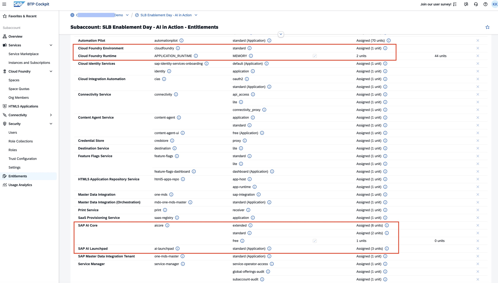

---

## 🏗 Scenario

You are supporting a procurement process where multiple suppliers respond to an RFQ with documents (PDF/Excel/CSV). RFQx helps you:
- ingest supplier documents
- extract structured attributes you select
- build a **knowledge graph** from extracted facts
- generate AI-powered summaries and enable conversational Q&A over processed content

---

## 📱 App Overview

RFQx is a five-page Streamlit application. Here is a quick look at each step of the workflow:

**1. Project Setup** — Create a new RFQ analysis project or resume an existing one. Projects act as containers for all supplier documents and extracted data within a session.

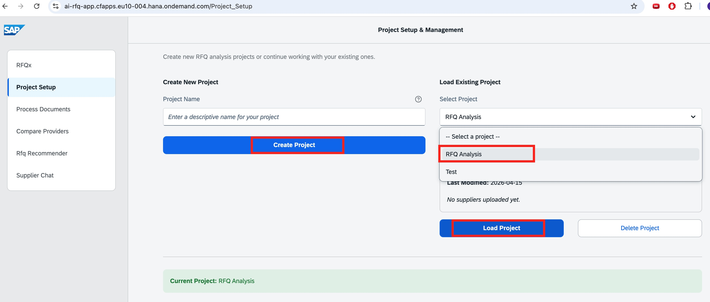

---

**2. Process Documents** — Define how many suppliers to compare, name each one, and upload their RFQ response documents (PDF, XLSX, CSV). Trigger AI extraction with a single click once all documents are attached.

> **Additional Note:** This demo uses manual file upload to keep the setup self-contained. In a real implementation the document ingestion step can be replaced or augmented by a direct connection to backend systems — SAP S/4HANA, SAP Ariba, HANA databases, or any other enterprise data source — so procurement data flows in automatically without manual upload.

> Because the app runs entirely on **SAP BTP infrastructure**, all data stays within your controlled environment — no information leaves your landscape. This also means the app can work with sensitive internal documents, complex multi-page contracts, or proprietary supplier data that could never be sent to a public SaaS tool. The tight integration with the SAP ecosystem makes it straightforward to connect additional enterprise systems and enrich the analysis with live operational data.

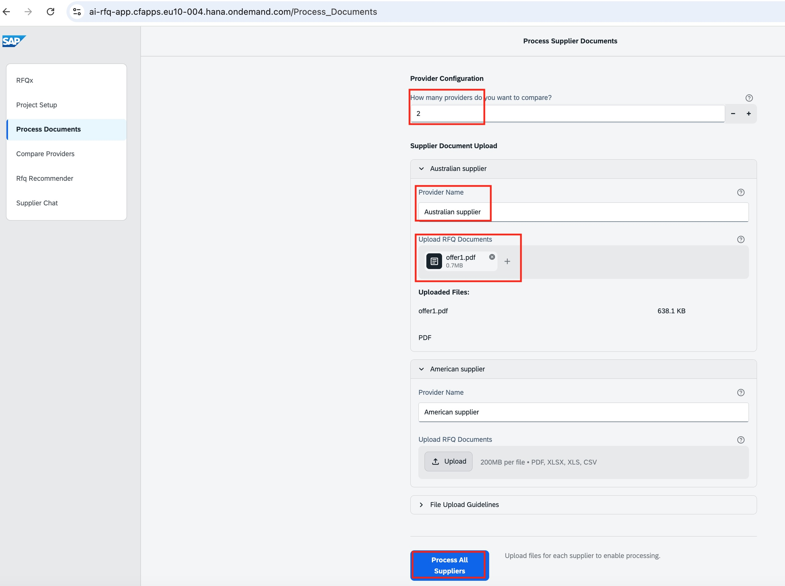

---

**3. Attribute Selection** — Before extraction runs, choose exactly which attributes the AI should pull from the documents — from project information and key dates to technical requirements and pricing. All attributes are grouped by category and can be toggled individually or in bulk.

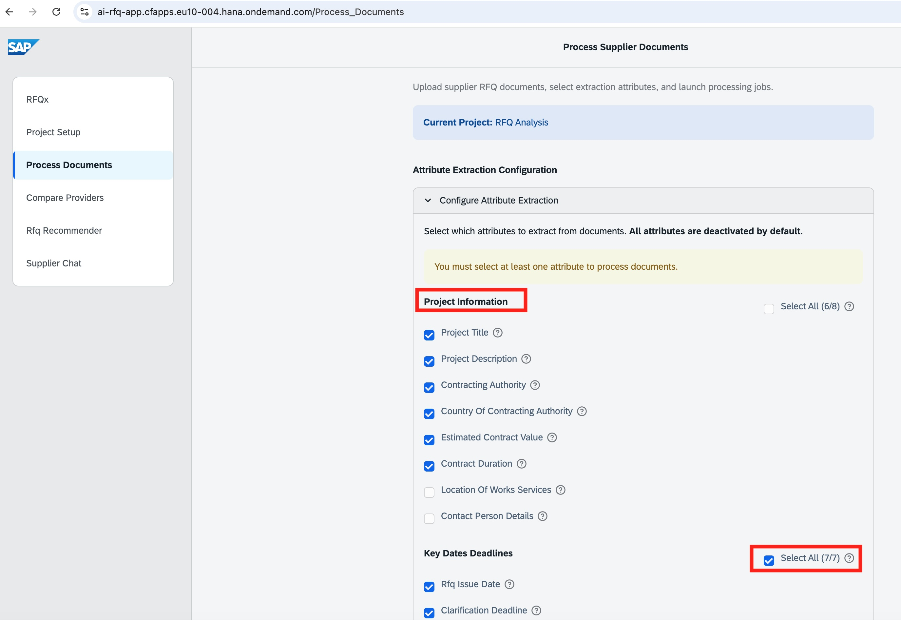

---

**4. Compare Providers** — Side-by-side comparison of all extracted attributes across suppliers. A completeness score per supplier shows how thoroughly each document answered the RFQ requirements, making gaps immediately visible.

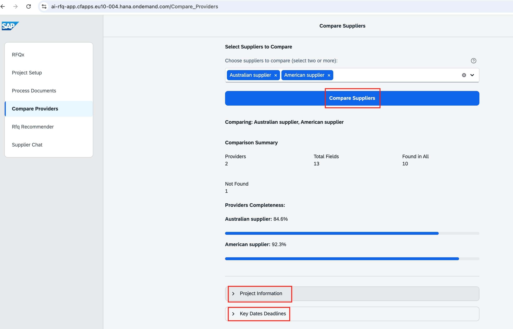

---

**5. RFQ Recommender** — Generates a comprehensive analysis report driven by the knowledge graph: executive summary, detailed Markdown comparison table, strengths and weaknesses per supplier, country risk factors, and a final recommendation. An interactive graph visualisation of supplier connections is also available.

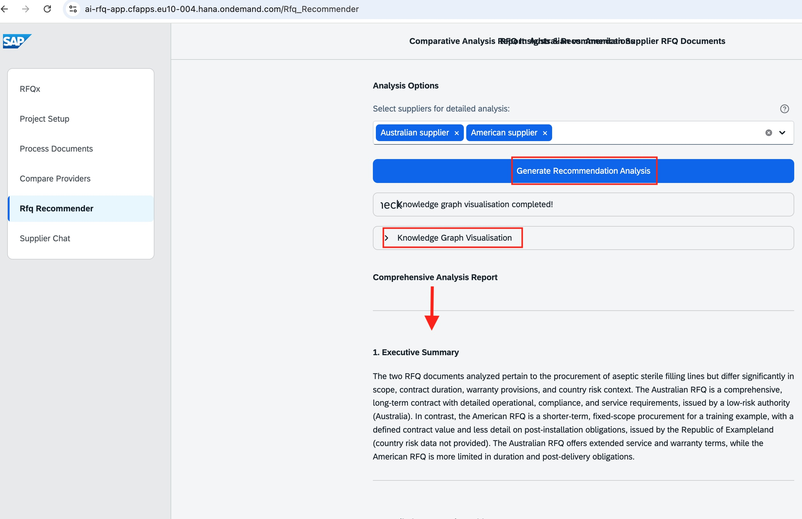

---

**6. Supplier Chat** — Conversational Q&A over the processed supplier documents. Select one or more suppliers to query, choose a query mode (single supplier or comparative analysis), pick from suggested questions or type your own, and get streaming AI answers grounded in the document content.

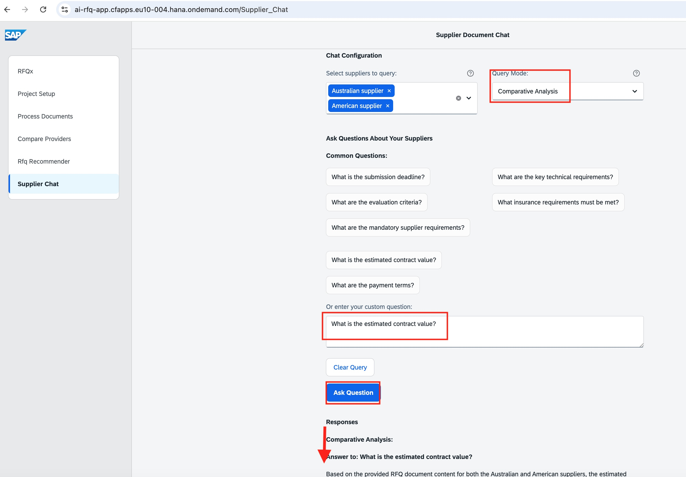

---

## 📦 Step 1: Find the RFQx application in the repo

#### Description
The application is included under `resources/app`.

#### ▶️ Actions
1. Open the folder:
   - `1 - AI-Powered Applications/resources/app/rfqx-doc-analysis-utilities/`
2. Identify the key files:
   - `manifest.yml` – Cloud Foundry app configuration
   - `Archive.zip` – prebuilt deployment artifact
   - `requirements.txt` – includes `generative-ai-hub-sdk`
   - `RFQx.py` – Streamlit entrypoint
   - `pages/` – the multi-page workflow
   - `llm_client.py` – AI client integration layer

#### ✅ Expected Result
You can locate `manifest.yml` and `Archive.zip`.

---

## 📦 Step 2: Configure `manifest.yml` (unique app name + resource group)

#### Description
Cloud Foundry routes are created from the app name, which must be unique.

#### ▶️ Actions
1. Open `1 - AI-Powered Applications/resources/app/rfqx-doc-analysis-utilities/manifest.yml`
2. Set a unique value for:
   - `applications[0].name` (example: `ai-rfq-app-<yourname>-2026`)
3. Confirm the default resource group env var (keep as-is unless instructed):
   - `AICORE_RESOURCE_GROUP: default`

#### ✅ Expected Result
Your manifest has a unique app name and `AICORE_RESOURCE_GROUP=default`.

---

## 📦 Step 3: Enable Cloud Foundry runtime and target org/space

#### Description
RFQx is deployed to Cloud Foundry.

#### ▶️ Actions
1. Ensure **Cloud Foundry Environment** is enabled in the subaccount
2. Ensure you have an **Org** and create a **Space**
3. (Optional) Log in with the CF CLI and target the correct org/space

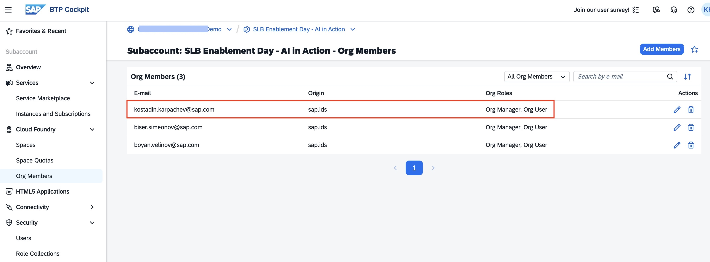

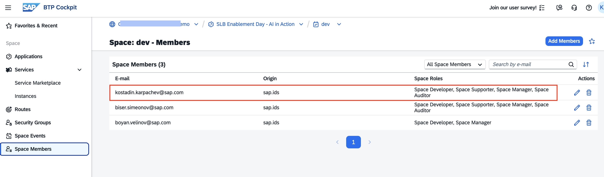

#### ✅ Expected Result
You are targeting the correct CF org and space.

---

## 📦 Step 4: SAP BTP subaccount walkthrough (AI Core + AI Launchpad)

#### Description
The app calls generative models through **SAP AI Core**.

> 📖 Official setup documentation:
> - [SAP AI Core – Initial Setup](https://help.sap.com/docs/sap-ai-core/sap-ai-core-service-guide/initial-setup?locale=en-US&version=CLOUD)
> - [SAP AI Launchpad – Initial Setup](https://help.sap.com/docs/ai-launchpad/sap-ai-launchpad/initial-setup?locale=en-US&version=CLOUD)

#### ▶️ Actions
### 4.1 Create an AI Core instance + service key
1. BTP Cockpit → **Services** → Instances
2. Create a new instance of **SAP AI Core**
3. Create a **Service Key** for that instance

> Workshop note: AI Core usage may be billable depending on your plan/model usage.

### 4.2 Subscribe to AI Launchpad
1. BTP Cockpit → **Instances and Subscriptions**
2. Subscribe to **AI Launchpad**
3. Make sure you have the necessary **permissions**
4. Open AI Launchpad

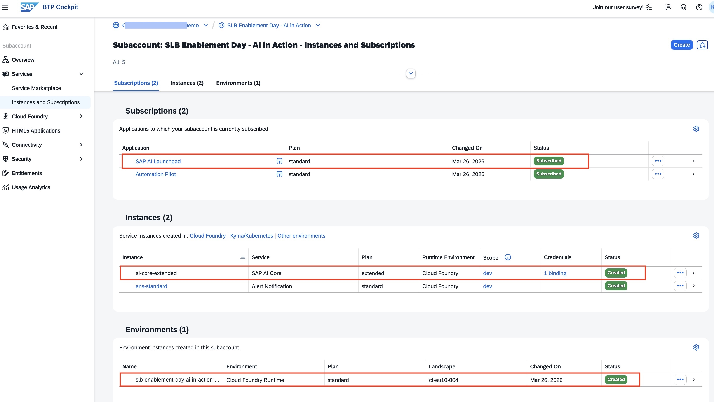

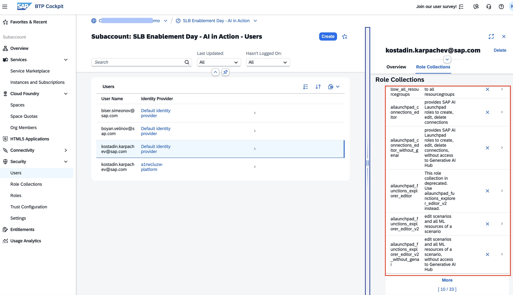

### 4.3 Create a model deployment
In AI Launchpad:
1. Select your AI Core instance and provide the information from the **service key**
3. Create a **configuration** for the model used in this app (foundation-models, 0.0.1, azure-openai, gpt-4.1)
3. Create a **deployment** for the model used in this app and wait for it to become running

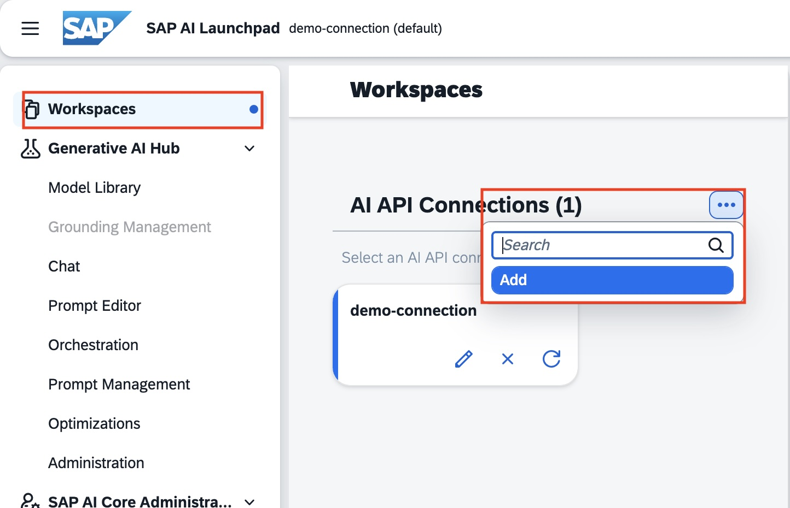

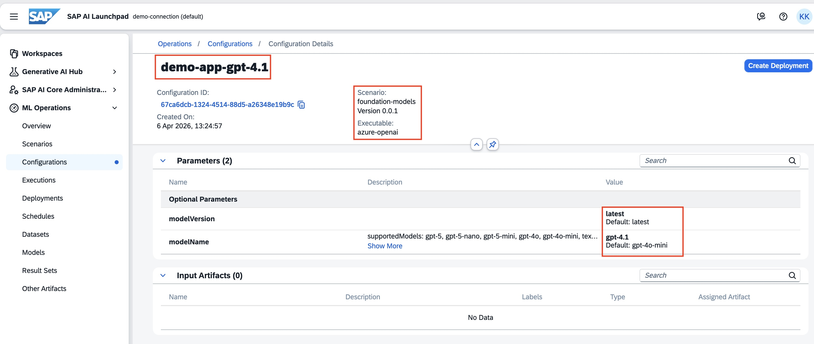

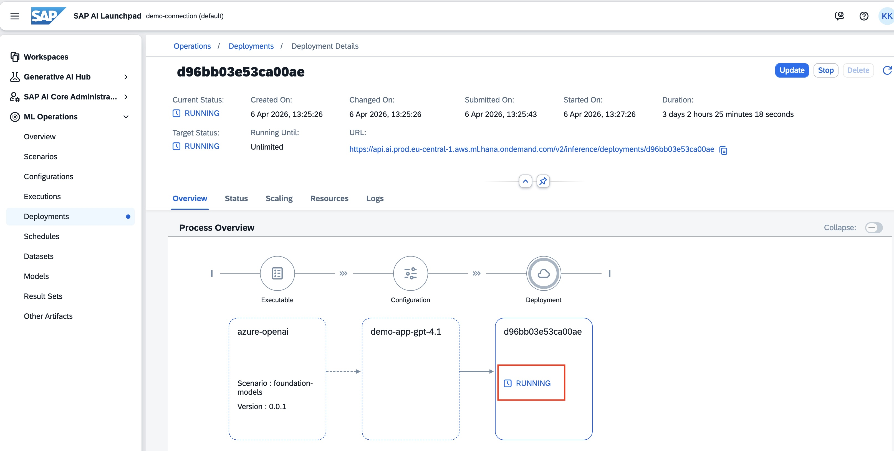

#### ✅ Expected Result
A model deployment is visible in AI Launchpad and is **RUNNING**.

---

## 📦 Step 5: Deploy the app to Cloud Foundry (archive + manifest)

#### Description
Use the prebuilt archive `Archive.zip` to deploy a clean package (no caches, no secrets).

#### ▶️ Actions
1. From `1 - AI-Powered Applications/resources/app/rfqx-doc-analysis-utilities/`, deploy using:
   - `manifest.yml`
   - `Archive.zip`

> Note: The archive intentionally excludes local virtual envs, caches (`__pycache__`), and `.env` secrets.

#### ✅ Expected Result
The app stages successfully and you can open the Streamlit UI via the created route.

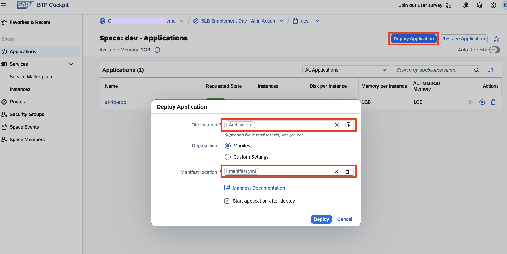

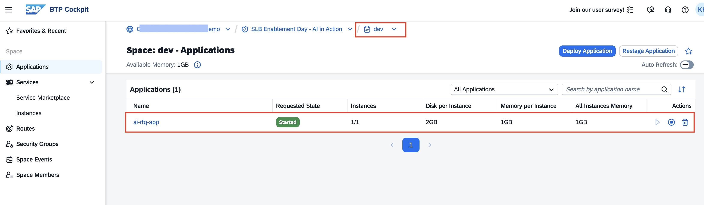

---

## 📦 Step 6: Option 1 (recommended): Service Binding to AI Core

#### Description
With service binding, the app reads AI Core credentials from the bound service (via `VCAP_SERVICES`), avoiding secrets in files. This is the recommended enterprise pattern.

**Two approaches exist — they are intentionally different:**
- **Tutor demo (recommended enterprise pattern):** Service Binding + credentials via `VCAP_SERVICES` — no secrets copied into files; credentials are injected into the app container at runtime.
- **Attendees (workshop mode):** Set environment variables based on a shared service key — no CF service instance/binding required. A shared service key (read-only / restricted where possible) is provided for the workshop to avoid charging attendees. Do not reuse these keys outside the workshop.

#### ▶️ Actions (Service Binding – tutor / enterprise pattern)
1. In Cloud Foundry, create or reuse an **AI Core service instance** in your space
2. Bind the AI Core instance to your deployed RFQx app
3. Restage/restart the app so the binding credentials are injected via `VCAP_SERVICES`

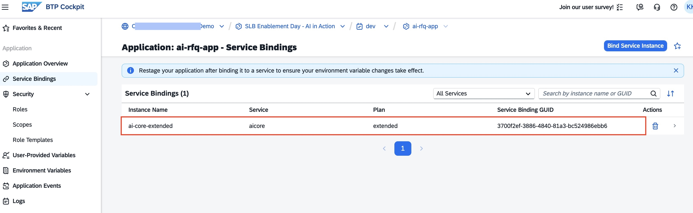

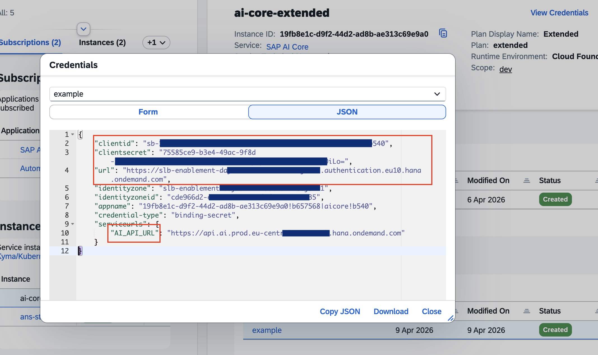

#### ✅ Expected Result
AI-powered features (summarize/compare/chat) work without manually setting secrets.

---

## 🧪 Validation / Test Your Result

1. Open the app route.
2. Quick path: load the demo data (if offered by the UI).
3. Or upload sample docs:
   - `1 - AI-Powered Applications/resources/docs/offer1.pdf`
   - `1 - AI-Powered Applications/resources/docs/offer2.pdf`
   - `1 - AI-Powered Applications/resources/docs/offer3.pdf`

   > These are fictitious supplier offers responding to a pharmaceutical procurement RFQ, created for demonstration purposes only.
4. Suggested page flow:
   - **Project Setup**: create a new project
   - **Process Documents**: upload docs per provider, select attributes, run extraction
   - **Compare Providers**: review side-by-side comparison + completeness
   - **RFQ Insights**: generate the knowledge graph + narrative summary
   - **Supplier Chat**: ask questions over processed supplier content

Expected:
- ✔ A comparison summary is generated
- ✔ Knowledge graph / insights are produced
- ✔ AI summaries and chat respond successfully

### Technologies to point out
- Streamlit session state + reusable UI components
- Knowledge graph generation from extracted attributes
- `generative-ai-hub-sdk` for calling AI Core deployments

---

## 🔬 Under the Hood: Key Technical Components

### AI Core connectivity (`llm_client.py`)

All LLM calls go through `SimplifiedRAGClient` in `llm_client.py`. The integration pattern is worth understanding:

**Import and authentication**

```python
from gen_ai_hub.proxy.native.openai import chat
```

The `generative-ai-hub-sdk` provides a drop-in OpenAI-compatible `chat` object. Authentication is handled transparently by the SDK — it reads credentials either from the CF service binding (`VCAP_SERVICES`) or from environment variables set at runtime. No manual token management is needed in the app code.

**Request pattern**

Every call to the LLM follows the same structure:

```python
response = chat.completions.create(
    model="gpt-4.1",
    messages=[
        {"role": "system", "content": system_prompt},
        {"role": "user",   "content": user_prompt}
    ],
    temperature=0.1,
    max_tokens=4096
)
```

The `model` name (`gpt-4.1`) matches the **deployment name** you created in AI Launchpad. The SDK routes the request to the AI Core inference endpoint for that deployment.

**Streaming for chat / long responses**

The `answer_specific_query_streaming` and `generate_completion_streaming` methods use `stream=True`. This yields response chunks incrementally to the Streamlit UI, giving real-time token-by-token output instead of waiting for the full response:

```python
response = chat.completions.create(..., stream=True)
for chunk in response:
    content = chunk.choices[0].delta.content
    if content:
        yield content   # streamed to the UI
```

If streaming is not supported by the deployment, the client falls back automatically to a non-streaming call.

**Retry logic**

Extraction calls (`extract_rfq_information`) wrap the LLM call in a retry loop (up to 3 attempts) with exponential backoff (`time.sleep(2 ** attempt)`), making the extraction resilient to transient API errors.

---

### Knowledge graph (`graph_processor.py`)

After extraction, `GraphProcessor` converts the structured JSON into a **directed knowledge graph** using [NetworkX](https://networkx.org/) and then uses that graph as context for the LLM comparison report.

**Building the graph**

Each extracted document becomes a `nx.DiGraph`. The JSON is walked recursively: every key becomes a **predicate** (edge label) and every value becomes a **node**. The result is a set of RDF-style triples:

```
(subject, predicate, object)
# e.g.
('offer1.pdf', 'submission_deadline', '2024-03-15')
('offer1.pdf', 'estimated_contract_value', '€120,000')
```

Nested objects create intermediate nodes; list items each get their own node. Values equal to `"Not Found"` are intentionally omitted to keep the graph clean.

**Serializing the graph into the LLM prompt**

Before sending to the LLM, the graph is serialized back to plain text triplets:

```
# Document data: offer1.pdf
('offer1.pdf', 'submission_deadline', '2024-03-15')
('offer1.pdf', 'estimated_contract_value', '€120,000')
...
```

All supplier graphs are concatenated into a single block injected into the comparison prompt. This gives the LLM a **structured, unambiguous view** of the data instead of raw document text — reducing hallucination and making cross-document comparison more reliable.

**What the LLM does with the graph**

`GraphProcessor.generate_comparison_report_from_graphs` orchestrates:
1. Build one graph per document
2. Serialize all graphs to the triplet text format
3. Send to the LLM with a prompt asking for: executive summary, comparative Markdown table, strengths/weaknesses per supplier, and a recommendation

The LLM is instructed to reason **exclusively** from the graph triples, not from free text — this is the key architectural choice that makes the comparison structured and auditable.

**Interactive visualization**

`create_interactive_graph` merges all per-document graphs into a combined graph and renders it as an interactive [Plotly](https://plotly.com/) scatter plot. Each document gets a distinct color; nodes show their connections on hover.

---

### Storage behavior (important)
RFQx is designed for workshop/demo usage:
- The app does **not provide persistent storage**.
- Projects and uploaded documents are available **only while the app session is alive and the app is running**.
- If the app is stopped/restarted/redeployed, previously uploaded projects may no longer be available.

---

## 💻 Optional: Run the App Locally

If you want to test the app on your machine before (or instead of) deploying to Cloud Foundry:

#### ▶️ Actions

```bash
# From the app folder
cd "1 - AI-Powered Applications/resources/app/rfqx-doc-analysis-utilities"

# Create virtual environment
python -m venv venv

# Activate it (macOS/Linux)
source venv/bin/activate
# On Windows:
# venv\Scripts\activate

# Install dependencies
pip install -r requirements.txt

# Run the app
streamlit run RFQx.py
```

You still need AI Core credentials. Set them as environment variables before running (using the shared service key provided for the workshop, or your own service key):

```bash
export AICORE_AUTH_URL=...
export AICORE_CLIENT_ID=...
export AICORE_CLIENT_SECRET=...
export AICORE_BASE_URL=...
export AICORE_RESOURCE_GROUP=default
```

> The app will be available at `http://localhost:8501` by default.

---

## 🔧 Troubleshooting

- **App does not start in CF:**
  - Check `manifest.yml` app name uniqueness
  - Check Python buildpack staging logs
  - Verify `PORT` is used (already configured in the manifest command)

- **AI calls fail:**
  - Ensure AI Core subscription exists
  - Ensure a model deployment exists in Launchpad and is **RUNNING**
  - Verify the resource group (`AICORE_RESOURCE_GROUP`) matches
  - Verify service binding / service key credentials

---

## 💡 Key Takeaways

- RFQx demonstrates an end-to-end AI workflow: ingestion → extraction → graph → summaries/chat.
- The app uses **`generative-ai-hub-sdk`** to call models via **SAP AI Core**.
- **Cloud Foundry** provides a simple deployment model for this Streamlit app.
- Project data is **session-only** (no persistent storage across app restarts).

---

## Optional note: Cost / quota disclaimer

- **SAP AI Core usage may be billable** depending on your plan and the model used.
- For enablement sessions, a **shared service key** will be provided to avoid charging attendees.
- We still demonstrate **service binding** as the recommended enterprise pattern.

---

## Next Step

👉 Continue with the next exercise (as directed by the instructors).
