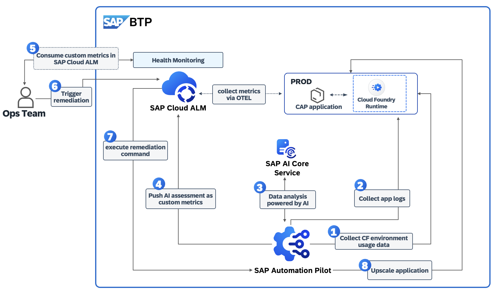

# Topic #3 | Intelligent Day 2 Operations with AI

## Description
This repository contains the material for the Topic #3  - **"Intelligent Day 2 Operations with AI"**

## Overview

This hands-on session introduces participants to SAP Automation Pilot and SAP Cloud ALM in the context of Day 2 Operations. The main  goal is for participants to gain practical experience in automating different set of technical operation tasks in SAP Business Technology Platform (SAP BTP). To do so, is needed to set up an integration between SAP Automation Pilot and SAP Cloud ALM. During this hands-on we will explore how to trigger ready-to-use commands in SAP Automation Pilot to do troubleshooting and perform remediation actions based on alerts in SAP Cloud ALM. You will also learn how to build your own automation flows or extend existing ones.

## **Main scenario covered during this session:**
 
Within the hands-on tutorial we will cover: 
- Introduction to **SAP Automation Pilot** for running repetitive ops tasks
- Introduction to **SAP Cloud ALM**
- Extending SAP Automation Pilot by an integration to SAP AI Core service for **assessment of technical data and recommendations by AI**
- Integration between SAP Automation Pilot and SAP Cloud ALM for  automating **operational tasks and remediations**

**Hands-on:**
  - Creating and testing **automation workflows** for common operational tasks.
  - Extending SAP Automation Pilot by integrating it to SAP AI Core service.
  - Exploring potential **use cases** where SAP Automation Pilot and SAP Cloud ALM adds value for Ops teams by using GenAI features provided by SAP

## Products in focus 
### SAP Automation Pilot 
The goal of SAP Automation Pilot is to simplify and automate complex manual technical processes and flows. This enables DevOps teams to run their solutions on SAP BTP with minimal operational effort.

#### SAP Automation Pilot is a low-code / no-code automation engine that allows you to:
- Automate sequences of steps,
- Execute scripts in a serverless manner,
- Use catalogs of commands provided by SAP to automate typical Ops tasks in and outside your SAP BTP landscape,
- Build custom automations.
 
Automations in SAP Automation Pilot can be triggered in various ways to best fit your operational needs - manually by the DevOps team, through the built-in scheduler, automatically via integration with services and ops platforms like SAP Cloud ALM, or by other applications and systems.

The service is designed to work with low latency, even under a heavy workload, and is capable of triggering hundreds of automations simultaneously.

### SAP Cloud ALM for Operations

**SAP Cloud ALM** is SAP’s cloud-based application lifecycle management solution designed to support the implementation and operation of SAP cloud and hybrid landscapes. It provides end-to-end transparency across business processes, integrations, and system health. 

**Cloud ALM for Operations** focuses on ensuring business continuity by monitoring the availability, performance, and exceptions of cloud and on-premise solutions. It enables IT and operations teams to proactively detect and resolve issues through automated alerts, analytics, and intelligent insights. Together, they help organizations achieve efficient, reliable, and compliant operations across your SAP environment.

##  **Let's Build & Automate!**
This TechEd session is **interactive  hands-on**, ensuring you gain **real-world experience** with products and tools delivered by SAP. Get ready for your Day 2 Operations activities!

## Prerequisites (Already Prepared for You)

The following setup and access prerequisites have been **preconfigured for all participants**.  
You do **not** need to perform any setup steps — simply proceed with the hands-on exercises.

- Access to **SAP Automation Pilot**  
- Access to **SAP Cloud ALM**  
- A **Cloud Foundry CAP application** deployed in your SAP BTP subaccount   
- **SAP AI Core** credentials with a **GPT-4o** deployment  
- A **technical user** on your **SAP BTP Cloud Foundry** space (already assigned to each participant)

## Exercises
Let's start the exercise - for a better understanding, please follow the exercise as listed below:
Continue to: 
- [Getting Started](exercises/ex0/)

## How to obtain support
Support for the content in this repository is available during the actual time of session delivery. Otherwise, you may request support via the [Issues](../../issues) tab.

